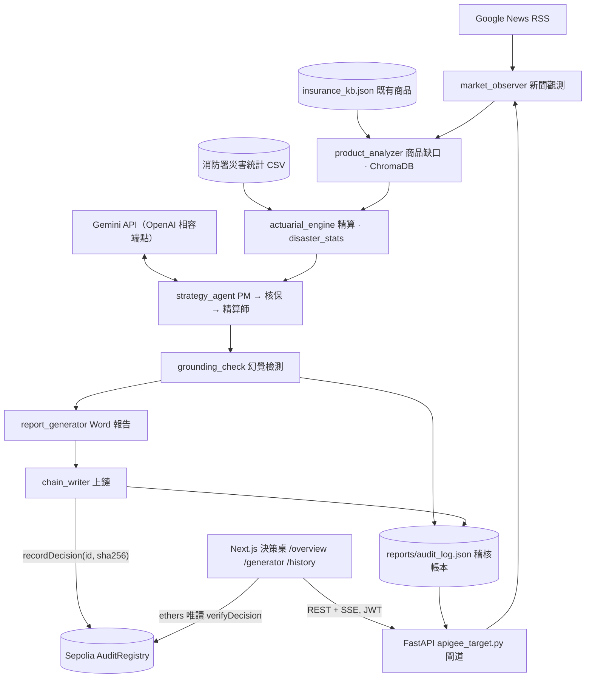

# 未然 ForeSure

> 提前發現尚未被保障的風險 · Find uninsured risks before they happen
> FUTUREMODE × SITCON BUILDMODE Gen-AI Hackathon 2026 · 國泰金控 AI Agent 賽道

## 問題與目標

新型風險（極端氣候、資安事件、供應鏈中斷）常在新聞出現數週後，市場上仍沒有對應的保險商品，而傳統商品開發從發想到提案要數個月。若直接讓 LLM 寫提案，數字沒有來源、結論無法稽核，金融機構不敢採用。

未然 ForeSure 是給金控商品企劃、核保、精算與風控團隊使用的**內部提案加速器**：從一則新聞出發，比對既有商品缺口、用官方災害統計定價、由三個 AI 代理人辯論後產出中英雙語提案，經過幻覺檢測，再把提案雜湊寫進區塊鏈存證。整個流程約一分鐘，每個數字都能指回原始資料或明確標示為假設值，最終決策仍由人審核。AI 只做內部提案輔助，商品上市仍須依金管會核准／備查程序與合格簽署人員。

## 核心功能

- **新聞觸發**：抓取 Google News RSS，由 LLM 挑出最值得開發商品的一則災害或時事新聞。
- **商品缺口比對**：以多語言句向量模型與 ChromaDB 比對既有保單庫 `insurance_kb.json`，找出最接近的競品與缺口。
- **統計驅動精算**：颱風、水災、地震的發生機率取自內政部消防署 1958–2025 逐事件統計，保費 = 年頻率 × 單次損失 × 加成；每個數字附 `basis` 欄位，區分真實統計與假設值。
- **三代理人辯論**：產品經理提案、核保人員挑毛病、精算師整合，以 function calling 產出六個欄位的中英雙語提案。
- **幻覺檢測**：純規則、不呼叫 LLM 的 `grounding_check.py`，檢查無來源的數字、捏造的引用與未揭露的假設值，結論與標記數一起上鏈。
- **區塊鏈存證與驗證**：提案內容雜湊寫入 Sepolia 測試網的 `AuditRegistry` 合約；前端可即時驗證，並提供竄改測試示範不一致時的結果。
- **中英雙語 Word 報告**：每輪自動產出 docx，新聞標題可連回原始報導，數據依據段落附統計來源。
- **前端決策桌**：首頁、決策總覽、啟動分析（SSE 即時串流 12 個階段）、歷史紀錄庫四頁；淺／深色、中／英切換；離線時顯示標記為模擬的示範資料。
- **企業 API 閘道**：JWT 驗證、IP 頻率限制、CORS 白名單，對準國泰 Apigee 閘道的接入方式。
- **AMD ROCm 擴充模組**：百萬次巨災蒙地卡羅壓力測試（99.5% VaR／TVaR）、BGE-M3 條款級語意檢索、多模態影像核保，結果快照接進精算引擎與前端卡片。

## 系統架構



- **前端**：Next.js 16 靜態匯出，部署在 Cloudflare Pages。透過 REST 讀歷史與詳情，透過 SSE 看一次執行的 12 個階段；驗證時用 ethers 直接讀 Sepolia 公開節點，不經過後端。
- **後端**：FastAPI 的 `apigee_target.py` 負責 JWT、限流、CORS 與端點，`main.py` 串起 pipeline 七個模組；`run_store.py` 把每輪結果寫進 `reports/audit_log.json`，這份帳本就是歷史紀錄與驗證的依據。端點契約見 `docs/API.md`。
- **模型**：LLM 走 Gemini 的 OpenAI 相容端點，主模型被限流時自動切備援；語意比對用 fastembed 多語言模型，ChromaDB 以記憶體模式在啟動時建索引。
- **資料**：`data/nfa_disaster_events.csv` 由 `scripts/convert_nfa_stats.py` 從消防署原始 xls 轉出；AMD 模組的結果快照在 `data/*_benchmark.json`。
- **外部服務**：Google News RSS、Gemini API、Ethereum Sepolia 測試網（PublicNode 公開 RPC）。

## 使用技術

| 類型 | 技術／服務 | 用途 |
| --- | --- | --- |
| AI 模型 | Gemini 3.5 Flash-Lite（備援 Gemini 3.1 Flash-Lite），OpenAI 相容端點 | 挑選新聞、三代理人辯論、function calling 產出雙語提案 |
| AI 模型 | `sentence-transformers/paraphrase-multilingual-MiniLM-L12-v2`（fastembed）+ ChromaDB | 新聞與既有商品的多語言語意比對 |
| AI 模型 | `BAAI/bge-m3`（AMD ROCm） | 條款級語意檢索擴充模組 |
| 前端 | Next.js 16、React 19、TypeScript、Tailwind CSS v4 | 決策桌四頁，`output: export` 靜態匯出 |
| 前端 | ethers v6、three.js、lucide-react、Vitest | 瀏覽器端鏈上驗證、首頁葉子動畫、圖示、單元測試 |
| 後端 | Python 3.11+、FastAPI、Uvicorn、PyJWT | REST + SSE API、JWT 驗證、頻率限制、CORS |
| 後端 | feedparser、python-docx、web3.py、APScheduler、pytest | 新聞抓取、Word 報告、上鏈、排程、測試 |
| 區塊鏈 | Solidity、Hardhat、Ethereum Sepolia 測試網 | `AuditRegistry` 存證合約：`recordDecision` / `verifyDecision` |
| 資料 | 內政部消防署 臺灣地區天然災害損失統計表 1958–2025 | 颱風、水災、地震的年頻率與平均受災戶數 |
| Sponsor 技術 | AMD ROCm on AMD AUP Learning Cloud | 百萬次巨災蒙地卡羅、BGE-M3 檢索、影像核保（`scripts/amd_rocm_*`） |
| 部署 | Cloudflare Pages（前端）、Docker Compose（後端） | 靜態站託管、後端容器化 |

## 安裝與執行

```bash
# 需求：Python 3.11+、Node.js 20+、git
git clone https://github.com/zhuang768/ForeSure.git
cd ForeSure

# 1. 後端
python -m venv venv && source venv/bin/activate
pip install -r requirements.txt
cp .env.example .env              # 填入 Gemini API 金鑰（免費層即可）
uvicorn apigee_target:app --port 8080
# 沒有金鑰也能跑完整流程：提案會以 is_mock 標記為模擬，存證進入本地模擬模式，不會有鏈上紀錄。

# 2. 前端（另一個終端機）
cd frontend
cp .env.local.example .env.local  # 預設指向 localhost:8080 與已部署的 Sepolia 合約
npm install
npm run dev                       # http://localhost:3000

# 3. 測試與建置
python -m pytest -q               # 後端（專案根目錄）
cd frontend && npm test           # 前端 Vitest
npm run build                     # 靜態匯出到 frontend/out/

# 4.（選填）自己部署存證合約並啟用真正的上鏈
cd atlas-chain && npm install
cp .env.example .env              # 測試錢包私鑰、Sepolia RPC；chain_writer 讀的是這個檔
npx hardhat run scripts/deploy.js --network sepolia
# 把合約地址填回 atlas-chain/.env 的 CONTRACT_ADDRESS 與 frontend/.env.local 的 NEXT_PUBLIC_CONTRACT_ADDRESS，重啟後端

# 5.（選填）不開 API、直接排程執行 pipeline，或用 Docker
python main.py                    # 立即跑一輪，之後每 60 分鐘一輪
docker compose up --build         # 同時起排程與 API 兩個容器
```

後端 `.env` 的 `ATLAS_ALLOWED_ORIGINS` 要包含前端來源，本機預設已允許 `localhost:3000`。後端沒開 `--reload`，改了 Python 程式要手動重啟。

## 作品展示

- 作品展示網址（選填）：
- 評選影片：

## 限制與未來工作

**已知限制**

- 消防署資料沒有金額，單次損失 = 歷史平均受災戶數 × 假設的每戶損失（住宅地震基本保險全損給付 NT$150 萬）；水災嚴重事件只有 3 筆，`basis.low_sample` 會標記；資安、健康等類別沒有官方統計，全部標為假設值。
- 幻覺檢測是純規則：只看數字與引用句型，抓不到沒有數字的誇大宣稱，也無法判斷商業邏輯是否合理。
- LLM 走 Gemini 免費層，有每日請求上限；限流時自動切備援模型，第三次失敗才退回模擬提案。
- 上鏈只寫入提案雜湊，不含內容；使用單一測試錢包與 Sepolia 測試網，尚未設計多簽或正式鏈。
- Cloudflare Pages 上的前端需要連到後端才有真資料，連不到時顯示的是標記為模擬的示範資料。
- AMD ROCm 模組在沒有 ROCm 硬體的環境讀取 `data/*_benchmark.json` 快照，不會現場重算。
- 法規上 AI 只能做內部提案輔助，商品上市仍須金管會核准／備查與合格簽署人員。

**未來工作**

- 紅隊測試台：用固定的對抗語料反覆攻擊幻覺檢測，公開檢出率、誤報率與已知漏洞。
- 新聞提示注入防護：RSS 標題與摘要進入提示前先過規則掃描，結論一併上鏈。
- 人審佇列與簽核：需人審的提案進入待辦，核准者的簽章與時間一起存證。
- 雙模型「AI 裁判」交叉檢核提案，補純規則檢查的盲點。
- 接入真正的 Apigee 閘道與金控 SSO；AI 提案通過後由風控代理人數位簽章、雙重授權後才可觸發準備金流程。

## 第三方服務、資料與素材

| 項目 | 來源與連結 | 授權／使用方式 |
| --- | --- | --- |
| 內政部消防署 臺灣地區天然災害損失統計表（1958–2025） | https://www.nfa.gov.tw/cht/index.php?code=list&ids=233 | 政府網站公開統計資料，原始 xls 與轉出的 CSV 放在 `data/`，每筆精算數字的 `basis` 標示來源 |
| Google Gemini API（OpenAI 相容端點） | https://ai.google.dev/ | 依 Gemini API 服務條款使用；金鑰只放在被 `.gitignore` 忽略的 `.env` |
| Google News RSS | https://news.google.com/rss | 只取標題、摘要與連結作為觸發與引用，報告中連回原始報導 |
| Ethereum Sepolia 測試網、PublicNode 公開 RPC、Etherscan | https://ethereum-sepolia-rpc.publicnode.com 、 https://sepolia.etherscan.io | 測試網存證與驗證，免金鑰；私鑰只放在 `atlas-chain/.env` |
| `sentence-transformers/paraphrase-multilingual-MiniLM-L12-v2` | https://huggingface.co/sentence-transformers/paraphrase-multilingual-MiniLM-L12-v2 | Apache 2.0，經 fastembed 載入 |
| `BAAI/bge-m3` | https://huggingface.co/BAAI/bge-m3 | MIT |
| Geist、Geist Mono 字型 | https://vercel.com/font | SIL Open Font License 1.1，經 `next/font/google` 載入 |
| Next.js、React、Tailwind CSS、ethers、three.js、lucide-react、FastAPI、ChromaDB、web3.py 等開源套件 | 見 `requirements.txt`、`frontend/package.json`、`atlas-chain/package.json` | 各自的 MIT／Apache 2.0／ISC 授權 |
| 品牌 Logo 與首頁插圖 | `frontend/public/brand/`、`frontend/public/illustrations/` | 團隊自製（以 AI 影像生成後整理），說明見 `frontend/public/brand/README.md` |

儲存庫不含任何金鑰、Token 或個人資料；`.env`、`atlas-chain/.env`、`frontend/.env.local` 皆被 `.gitignore` 忽略，範本為對應的 `.example` 檔。

## 團隊成員

| 姓名 | 分工 |
| --- | --- |
|  |  |
|  |  |

## License

本專案採用 [MIT License](./LICENSE)。
