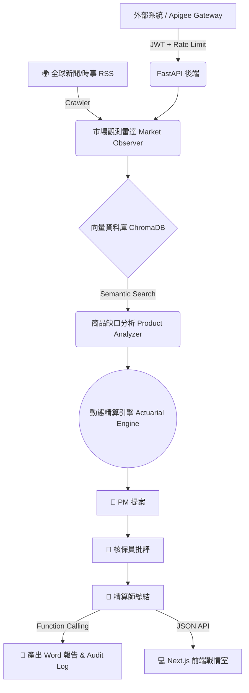

# 🛡️ Atlas: 企業級 AI 智慧保險戰情室 (AI Insurance GenAI Platform)

> **FUTUREMODE x SITCON BUILDMODE GEN-AI HACKATHON 2026**
> **🏆 國泰金控 AI AGENT 賽道專屬解決方案**

Atlas 是一個專為大型金融控股公司（如國泰金控）設計的 **「金融級 Multi-Agent 自動化保險開發與風控平台」**。
本專案打破傳統保險商品開發耗時數月的瓶頸，利用 AI 代理人即時觀測全球災難與時事，自動比對現有商品缺口，並透過**多代理人辯論 (Multi-Agent Debate)** 產出極具商業價值的保險提案與精算定價。同時，具備企業級 API 安全閘道與高質感前端戰情室。

---

## ✨ 核心亮點與企業級架構 (Key Features)

### 1. 🧠 多重人格大腦：AI 內部激辯機制 (Multi-Agent Debate)
放棄單一 LLM 容易產生的幻覺與不切實際，我們的 `Strategy Agent` 內建了三層架構：
- **產品經理 (PM)**：負責吸收災難新聞，發想出極具破壞性創新的保險點子。
- **資深核保人員 (Underwriter)**：無情挑剔點子中的道德風險與理賠漏洞。
- **精算師 (Actuary)**：整合雙方意見，修補漏洞，並產出最終邏輯嚴密的正式提案。

### 2. 📊 大數據語意搜尋 (Semantic Search with ChromaDB)
拋棄傳統關鍵字比對。系統內建 `ChromaDB` 向量資料庫，將國泰現有保單庫 (`insurance_kb.json`) 向量化。當重大新聞發生時，AI 能以向量餘弦相似度瞬間抓出最相近的競品，精準打擊「市場缺口」。

### 3. 📈 動態精算與歷史回測 (Actuarial Engine & Backtesting)
- **消防署歷史統計**：颱風、水災、地震的發生機率取自內政部消防署「臺灣地區天然災害損失統計表」（1958–2025 逐事件，原始檔與 CSV 在 `data/`，轉換腳本在 `scripts/`）。以 1995 年後、單次受災 50 戶以上的嚴重事件計算年頻率，保費 = 年期望損失（年頻率 × 單次損失）× 加成。
- **誠實標示來源**：消防署資料沒有金額，單次損失 = 歷史平均受災戶數 × 假設的每戶損失（住宅地震基本保險全損給付 NT$150 萬）。每個數字附 `basis` 欄位，區分真實統計與假設值；資安、健康等沒有官方統計的類別明確標為假設值。
- **中英雙語報告**：精算師的 function calling 對六個提案欄位同時產出繁體中文與英文版（`*_en`），並把觸發新聞的標題與摘要翻成另一種語言。Word 報告的每個標題與段落都中英並列，新聞標題可點擊連回原始報導，數據依據段落也附統計來源的英文名稱。
- **量化回測**：內建 `backtester.py`，可自動抓取過去（如 2021 德州暴風雪、2023 茂宜島野火）的歷史災難進行回測，向管理層證明 AI 發明之保單的財務可行性。

### 4. 🔒 企業級 API 閘道安全 (Apigee Ready)
為完美銜接國泰 Apigee API Gateway，後端 `apigee_target.py` 實作了：
- **JWT 企業級身分認證 (HTTPBearer)**
- **基於 IP 的頻率限制 (Rate Limiting)**，防止惡意 DDoS 攻擊。

### 5. 💻 前端決策桌 (Next.js + React + TypeScript)
兩頁：`/` 提案佇列與四分頁詳情（決策摘要、Agent 辯論重播、定價依據、證據與稽核含鏈上驗證與竄改測試），`/generator` 以 SSE 即時串流一次完整執行的 11 個階段。淺色／深色、中／EN、簡報模式三個切換。所有資料皆來自後端 API，沒有寫死內容；存證徽章只在鏈上真的有紀錄時才顯示綠色。

---

## 🗺️ 系統架構圖 (Architecture)



---

## 🚀 快速啟動指南 (Getting Started)

### 1. 環境需求與依賴安裝
本專案包含 Python 後端與 Next.js 前端。
請先安裝 Python 依賴：
```bash
pip install -r requirements.txt
```

### 2. 設定環境變數
在根目錄建立 `.env` 檔案，填入你的 OpenAI 金鑰（驅動多代理人運算的核心）：
```env
OPENAI_API_KEY=sk-your-openai-api-key
OPENAI_MODEL=gpt-4o-mini
```

### 3. 啟動後端 API 伺服器 (FastAPI)
此指令將啟動具備 JWT 防護的企業級 API 閘道器端點：
```bash
uvicorn apigee_target:app --reload --port 8080
```

### 4. 啟動前端決策桌 (Next.js)
開啟另一個終端機，進入 `frontend` 資料夾：
```bash
cd frontend
cp .env.local.example .env.local   # API 位址、Demo token、公開 RPC、合約地址
npm install
npm run dev        # http://localhost:3000
npm test           # Vitest 單元測試（事件 reducer、徽章狀態、i18n、格式化）
npm run build      # 靜態匯出到 out/，Cloudflare Pages 用
```
後端 `.env` 的 `ATLAS_ALLOWED_ORIGINS` 要包含前端的來源（本機預設已允許 `localhost:3000`）。

### 5. (可選) 執行歷史巨災回測腳本
若要向評審展示 AI 對過去真實災難的精算反應，請執行：
```bash
python backtester.py
```

---

## 🛡️ 可信 AI 與未來發展 (Trustworthy AI - Roadmap)
針對國泰金控注重的 **「金融級 Multi-Agent 的授權與交易安全」**，本專案未來可輕易擴充：
- **內部準備金的雙重授權交易**：當 AI 提案通過，系統將強制要求 Risk Control Agent 進行數位簽章，雙重授權後方可呼叫核心系統轉移準備金，完美實現有紀律的**資金自動化管理**與 **AI 決策存證 (Audit Trail)**。
