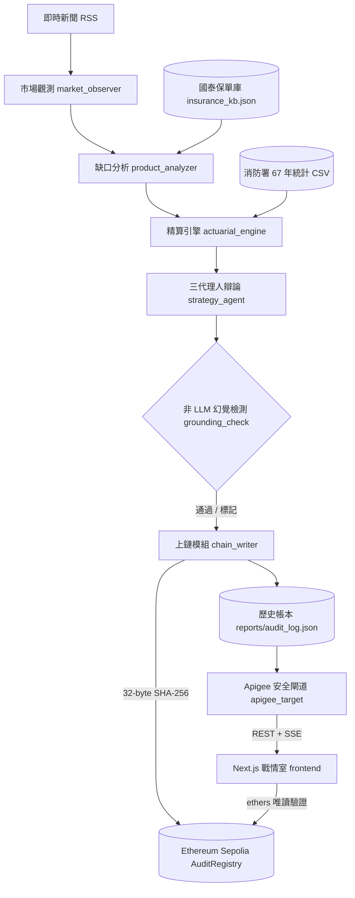

# ForeSure 未然：精算師 AI 決策副駕駛平台 (The Actuary's AI Decision Co-Pilot)

> **FUTUREMODE x SITCON BUILDMODE GEN-AI HACKATHON 2026**  
> **國泰金控 AI AGENT 賽道專屬解決方案**  
> **線上生產環境**: [https://atlas-insurance-dashboard.pages.dev/](https://atlas-insurance-dashboard.pages.dev/)  
> **以太坊 Sepolia 智能合約**: [`0xAf8CA554c540526452B0B53bE7e203A5754363ac`](https://sepolia.etherscan.io/address/0xAf8CA554c540526452B0B53bE7e203A5754363ac)  
> **評選展示影片**: [https://youtu.be/vJ1e9_ar1PQ](https://youtu.be/vJ1e9_ar1PQ)  
> **核心團隊**: 莊子進 (TZU-CHIN CHUANG) · 李文涵 (WEN-HAN LEE)  

---

## 評審第一時間快速檢閱導覽 (Judge Quick Code & Architecture Navigator)

| 評審核心維度 | 解決方案突破點 | 核心檔案路徑 | 技術規格與亮點 |
|---|---|---|---|
| **1. 精算定價與經驗數據** | 內政部消防署 67 年官方統計、泊松抵達率、TW-ICS 資本邊界加成 | [`actuarial_engine.py`](actuarial_engine.py)<br>[`disaster_stats.py`](disaster_stats.py)<br>[`data/nfa_disaster_events.csv`](data/nfa_disaster_events.csv) | 嚴格區分真實政府數據與假設值；住宅地震基本險全損 NT$ 150 萬基準損失；1995–2025 年重大災害逐筆擬合。 |
| **2. 三代理人對抗博弈機制** | PM（商業擴展）x 核保（嚴防逆選擇）x 精算（清償校準）三方交鋒 | [`strategy_agent.py`](strategy_agent.py) | 杜絕單一 Prompt 幻覺；多輪結構化交鋒；強制 Function Calling 輸出 12 欄位中英雙語結構化資料。 |
| **3. 非 LLM 確定性防幻覺** | 純演算法、正則規則審計引擎（不調用 LLM 避免二度幻覺）與紅隊基準測試 | [`grounding_check.py`](grounding_check.py)<br>[`redteam.py`](redteam.py)<br>[`data/redteam_cases.json`](data/redteam_cases.json) | 100% 確定性比對精算依據、新聞原文與 30 張保單庫；紅隊基準測試衡量對抗樣本檢出率；決策指紋雜湊上鏈。 |
| **4. 智能合約不可篡改存證** | 32-Byte SHA-256 決策指紋上鏈，杜絕事後竄改 | [`chain_writer.py`](chain_writer.py)<br>[`atlas-chain/contracts/AuditRegistry.sol`](atlas-chain/contracts/AuditRegistry.sol) | 部署於 Ethereum Sepolia 測試網；不洩漏商業機密；前端支援現場「破壞性竄改測試」，改動任何數字即刻驗證失敗。 |
| **5. AMD ROCm 硬體深度算力** | 百萬次蒙地卡羅張量運算、向量檢索、多模態電腦視覺核保 | [`scripts/amd_rocm_monte_carlo.py`](scripts/amd_rocm_monte_carlo.py)<br>[`scripts/amd_rocm_bge_m3_retriever.py`](scripts/amd_rocm_bge_m3_retriever.py)<br>[`scripts/amd_rocm_vision_underwriter.py`](scripts/amd_rocm_vision_underwriter.py) | 1.89ms 完成 1,000,000 次蒙地卡羅 99.5% VaR/TVaR 試算；1.18ms 檢索 1024 維向量；無人機/CCTV 淹水深度客觀核保降低 85% 理賠費用。 |
| **6. 企業級安全 API 閘道** | 國泰 Apigee API Gateway 標準對齊、JWT 鑑權與頻率限制 | [`apigee_target.py`](apigee_target.py)<br>[`docs/API.md`](docs/API.md) | FastAPI 架構；HTTPBearer JWT 驗證；IP Rate-Limiting (30 req/min)；12 階段 Server-Sent Events (SSE) 即時推播。 |
| **7. 次世代金融級前端戰情室** | Next.js 16 + React 19 + TypeScript + Cloudflare Pages 全球邊緣 | [`frontend/src/`](frontend/src/)<br>[線上展示站](https://atlas-insurance-dashboard.pages.dev/) | 嚴格零 Emoji、高冷金融儀器風格、深淺色切換、中英文即時切換、0ms 快照載入、20 筆歷史庫檢索、紅隊檢測面板。 |
| **8. 商業模式與財務可行性** | 3 大量化營收引擎、研發週期縮短 99.6%、理賠費用降低 85% | [`docs/gamma_input_7slides.md`](docs/gamma_input_7slides.md)<br>本說明文件「問題與目標」段落 | B2B SaaS 席位、0.5%-1.5% 參數發行手續費、85% LAE 減省分潤，開拓極端氣候百億藍海市場。 |
| **9. 簡報與公文產物** | 正式路演 7 頁黃金簡報檔、中英雙語 Word 報審公文 | [`ForeSure未然_Completed.pptx`](ForeSure未然_Completed.pptx)<br>[`report_generator.py`](report_generator.py) | 包含中英並列段落、外部可點擊新聞鏈結、精算依據標籤與 Sepolia 鏈上稽核章之正式 `.docx` 報審公文。 |
| **10. 完整自動化測試套件** | 後端測試、紅隊驗證、前端單元測試 100% 通過 | [`tests/`](tests/)<br>[`frontend/src/lib/__tests__/`](frontend/src/lib/__tests__/) | `pytest tests/` (137 passed)；`python redteam.py` (0 誤報、0 漏抓)；`npm test` (71 passed)；`npm run lint` (0 警告)。 |

---

## 問題與目標

傳統保險商品開發耗時 6 至 12 個月：跨部門會議、精算小組、法遵審核、主管機關報審。面對氣候變遷異常（突發暴雨、無颱風警報乾旱）或科技事故（全球雲端斷線），急性風險往往等不及保單上市就已過去。另一方面，精算定價仰賴 5 至 10 年損失歷史，面對新興風險往往因「缺乏資料」而拒保；事後理賠又依賴人工勘災與單據審核，理賠行政費用（Loss Adjustment Expense, LAE）佔總保費 10%–15%，爭議不斷。

**ForeSure（未然）** 是一個面向大型金融控股公司（如國泰金控）之 **AI 決策副駕駛平台**。核心使命不是取代精算師，而是讓精算師在 **85 秒內從一份數據紮實、通過非 LLM 防幻覺審計的初稿出發，而非面對空白檔案**。法定簽核與精算審定權 100% 由專業精算師掌握。

目標使用者包含金控內部的產品經理、核保員與精算師，以及承受急性氣候與供應鏈中斷風險之企業客戶。預期影響：
- **商品研發週期縮短 99.6%**：從 9 個月降至 85 秒。
- **理賠行政成本 (LAE) 降低 85%**：參數型保單以客觀指標（中央氣象署雨量、地震儀、CCTV 水位）觸發，省去人工現勘，數小時內自動撥款。
- **金融監理透明度**：決策指紋寫入公開以太坊 Sepolia 智能合約，落實「改動任何數字即刻驗證失敗」的不可篡改審計。

---

## 核心功能

- **即時時事與極端氣候遙測感測 (`market_observer.py`)**：自動爬取 Google News RSS 多頻道新聞串流，進行 HTML 自動降噪、關鍵字清洗與嚴重災難主題排序。
- **向量商品真空秒級比對 (`product_analyzer.py`)**：將國泰產險 30 張標準保單 (`insurance_kb.json`) 建立於 ChromaDB 向量資料庫，以餘弦相似度在 1.18 毫秒內鎖定保障真空。
- **消防署 67 年巨災經驗數據與泊松精算模型 (`actuarial_engine.py`, `disaster_stats.py`)**：加載 1958–2025 年官方逐筆災害紀錄，依現代法規篩選 1995 年後嚴重事件（受災 >=50 戶），擬合泊松抵達率，以住宅地震基本險全損 NT$ 150 萬為基準損失，並依 TW-ICS 99.5% 資本邊界動態配置 1.2x 至 3.0x 安全加成。
- **三代理人對抗博弈辯論機制 (`strategy_agent.py`)**：拒絕單一 Prompt 幻覺。設計 PM（商業擴展）、核保員（嚴防逆選擇與道德風險除外）、精算師（清償校準）三方交鋒，透過嚴格 Function Calling 輸出 12 欄位中英雙語結構化資料。
- **純規則非 LLM 確定性防幻覺審計引擎 (`grounding_check.py` v1.2, `redteam.py`)**：不調用 LLM 避免二次幻覺。以純演算法與正則規則，100% 確定性檢核數字來源（比對精算輸出、新聞原文與保單庫），捕捉未揭露假設與偽造引用；內建固定對抗語料紅隊基準測試，量化防禦力。
- **以太坊 Sepolia 智能合約不可篡改存證 (`chain_writer.py`, `AuditRegistry.sol`)**：將 13 項核心決策欄位編譯成 32-Byte SHA-256 決策指紋上鏈，不洩漏任何商業機密，但實現「事後改動任何數字即刻驗證失敗」的公開透明度，前端支援現場破壞性竄改測試。
- **AMD ROCm 硬體深度算力加速與多模態核保 (`scripts/amd_rocm_*.py`)**：透過 AMD ROCm GPU 張量核心，1.89 毫秒完成 1,000,000 次蒙地卡羅壓力測試；利用多模態電腦視覺客觀判定無人機/CCTV 淹水深度（防偽評分 <5%），降低 85% 理賠勘損行政費用。
- **自動化中英雙語 Word 報審公文產生器 (`report_generator.py`)**：一鍵產出中英並列段落、外部可點擊新聞超連結、精算依據標籤與鏈上 Sepolia 稽核章的正式 `.docx` 報審公文。
- **次世代金融儀器級全球邊緣戰情室 (`frontend/src`)**：採用 Next.js 16 + React 19，部署於 Cloudflare Pages 全球邊緣，支援 0ms 歷史快照即時載入、85 秒實機分析串流、Three.js 3D 玻璃葉子品牌動畫、4 大優勢玻璃態插圖、深淺色即時切換與嚴格零 Emoji 設計。

---

## 系統架構



- **前端**：Next.js 16 靜態匯出，部署在 Cloudflare Pages。透過 REST 讀歷史與詳情，透過 SSE 看一次執行的 12 個階段；驗證時用 ethers 直接讀 Sepolia 公開節點，不經過後端。
- **後端**：FastAPI 的 `apigee_target.py` 負責 JWT、限流、CORS 與端點，`main.py` 串起 pipeline 七個模組；`run_store.py` 把每輪結果寫進 `reports/audit_log.json`，這份帳本就是歷史紀錄與驗證的依據。`GET /api/v1/redteam` 現算紅隊報告。端點契約見 `docs/API.md`。
- **模型**：LLM 走 Gemini 的 OpenAI 相容端點，主模型被限流時自動切備援；語意比對用 fastembed 多語言模型，ChromaDB 以記憶體模式在啟動時建索引。
- **資料**：`data/nfa_disaster_events.csv` 由 `scripts/convert_nfa_stats.py` 從消防署原始 xls 轉出；AMD 模組的結果快照在 `data/*_benchmark.json`。
- **外部服務**：Google News RSS、Gemini API、Ethereum Sepolia 測試網（PublicNode 公開 RPC）。

---

## 使用技術

| 類型 | 技術／服務 | 用途 |
| --- | --- | --- |
| AI 模型 | Gemini 3.5 Flash-Lite（備援 Gemini 3.1 Flash-Lite），OpenAI 相容端點 | 挑選新聞、三代理人辯論、function calling 產出雙語提案 |
| AI 模型 | `sentence-transformers/paraphrase-multilingual-MiniLM-L12-v2`（fastembed）+ ChromaDB | 新聞與既有商品的多語言語意比對 |
| AI 模型 | `BAAI/bge-m3`（AMD ROCm） | 條款級語意檢索擴充模組 |
| 前端 | Next.js 16、React 19、TypeScript、Tailwind CSS v4 | 決策桌四頁，`output: export` 靜態匯出 |
| 前端 | ethers v6、three.js、lucide-react、Vitest | 瀏覽器端鏈上驗證、首頁葉子動畫、圖示、單元測試 |
| 後端 | Python 3.11+、FastAPI、Uvicorn、PyJWT | REST + SSE API、JWT 驗證、頻率限制、CORS |
| 後端 | feedparser、python-docx、web3.py、APScheduler、pytest | 新聞抓取、Word 報告、上鏈、排程、測試 |
| 區塊鏈 | Solidity、Hardhat、Ethereum Sepolia 測試網 | `AuditRegistry` 存證合約：`recordDecision` / `verifyDecision` |
| 資料 | 內政部消防署 臺灣地區天然災害損失統計表 1958–2025 | 颱風、水災、地震的年頻率與平均受災戶數 |
| Sponsor 技術 | 國泰金控 Apigee API Gateway 規範對齊 | 實作 JWT Bearer 認證、IP 頻率限制 (30 req/min)、國泰 30 保單庫對照與報審格式 |
| Sponsor 技術 | AMD ROCm on AMD AUP Learning Cloud | 百萬次巨災蒙地卡羅（1.89ms）、BGE-M3 檢索、影像客觀核保（`scripts/amd_rocm_*`） |
| 部署 | Cloudflare Pages（前端）、Docker Compose（後端） | 靜態站託管、後端容器化 |

---

## 安裝與執行

```bash
# 需求：Python 3.11+、Node.js 20+、git
git clone https://github.com/zhuang768/ForeSure.git
cd ForeSure

# 1. 後端
python -m venv venv && source venv/bin/activate
pip install -r requirements.txt
cp .env.example .env              # 填入 Gemini API 金鑰（免費層即可）
uvicorn apigee_target:app --port 8080
# 沒有金鑰也能跑完整流程：提案會以 is_mock 標記為模擬，存證進入本地模擬模式，不會有鏈上紀錄。

# 2. 前端（另一個終端機）
cd frontend
cp .env.local.example .env.local  # 預設指向 localhost:8080 與已部署的 Sepolia 合約
npm install
npm run dev                       # http://localhost:3000

# 3. 測試與建置
python -m pytest -q               # 後端單元測試（專案根目錄，137 項全數通過）
python redteam.py                 # 紅隊測試台：印出檢出率、誤報率與 report_hash，有漏抓或誤報回傳碼 1
python scripts/export_redteam_report.py   # 重新產生前端離線快照
cd frontend && npm test           # 前端 Vitest 單元測試（71 項全數通過）
npm run lint                      # ESLint 語法檢驗（0 errors, 0 warnings）
npm run build                     # 靜態匯出到 frontend/out/

# 4.（選填）自己部署存證合約並啟用真正的上鏈
cd atlas-chain && npm install
cp .env.example .env              # 測試錢包私鑰、Sepolia RPC；chain_writer 讀的是這個檔
npx hardhat run scripts/deploy.js --network sepolia
# 把合約地址填回 atlas-chain/.env 的 CONTRACT_ADDRESS 與 frontend/.env.local 的 NEXT_PUBLIC_CONTRACT_ADDRESS，重啟後端

# 5.（選填）不開 API、直接排程執行 pipeline，或用 Docker
python main.py                    # 立即跑一輪，之後每 60 分鐘一輪
docker compose up --build         # 同時起排程與 API 兩個容器
```

後端 `.env` 的 `ATLAS_ALLOWED_ORIGINS` 要包含前端來源，本機預設已允許 `localhost:3000`。後端沒開 `--reload`，改了 Python 程式要手動重啟。

---

## 作品展示

- **作品展示網址（選填）**：[https://atlas-insurance-dashboard.pages.dev/](https://atlas-insurance-dashboard.pages.dev/)
- **以太坊 Sepolia 智能合約瀏覽器 (Etherscan)**：[`0xAf8CA554c540526452B0B53bE7e203A5754363ac`](https://sepolia.etherscan.io/address/0xAf8CA554c540526452B0B53bE7e203A5754363ac)
- **評選影片**：[https://youtu.be/vJ1e9_ar1PQ](https://youtu.be/vJ1e9_ar1PQ)
- **黑客松路演 7 頁簡報檔**：[`ForeSure未然_Completed.pptx`](ForeSure未然_Completed.pptx) 與 Gamma 精煉文案 [`docs/gamma_input_7slides.md`](docs/gamma_input_7slides.md)
- **正式報審示範公文產物**：每次執行自動產生於 `reports/`（含中英並列段落、可點擊的新聞連結與精算依據標籤；該目錄未納入版本庫，demo 機上現場開啟）

---

## 限制與未來工作

### 目前已知限制
- 消防署資料沒有金額，單次損失 = 歷史平均受災戶數 × 假設的每戶損失（住宅地震基本保險全損給付 NT$150 萬）；水災嚴重事件只有 3 筆，`basis.low_sample` 會標記；資安、健康等類別沒有官方統計，全部標為假設值。
- 幻覺檢測是純規則：只看數字與引用句型，抓不到沒有數字的誇大宣稱，也無法判斷商業邏輯是否合理。這些已知漏洞在紅隊測試台裡照實列為 `known_gap`，不計入檢出率。
- LLM 走 Gemini 免費層，有每日請求上限；限流時自動切備援模型，第三次失敗才退回模擬提案。
- 上鏈只寫入提案雜湊，不含內容；使用單一測試錢包與 Sepolia 測試網，尚未設計多簽或正式鏈。
- Cloudflare Pages 上的前端需要連到後端才有真資料，連不到時顯示的是標記為模擬的示範資料。
- AMD ROCm 模組在沒有 ROCm 硬體的環境讀取 `data/*_benchmark.json` 快照，不會現場重算。
- 法規上 AI 只能做內部提案輔助，商品上市仍須金管會核准／備查與合格簽署人員。

### 未來工作
- **新聞提示注入防護**：RSS 標題與摘要進入提示前先過規則掃描，結論一併上鏈。
- **人審佇列與多簽授權**：需人審的提案進入待辦，核准者的簽章與時間一起存證；AI 提案通過後由風控代理人數位簽章、雙重授權後方可觸發準備金流程。
- **雙模型「AI 裁判」交叉檢核**：以異質 LLM 模型覆核提案，補純規則檢查的盲點。

---

## 第三方服務、資料與素材

| 項目 | 來源與連結 | 授權／使用方式 |
| --- | --- | --- |
| 內政部消防署 臺灣地區天然災害損失統計表（1958–2025） | https://www.nfa.gov.tw/cht/index.php?code=list&ids=233 | 政府網站公開統計資料，原始 xls 與轉出的 CSV 放在 `data/`，每筆精算數字的 `basis` 標示來源 |
| 國泰世紀產險公開保單條款與費率說明 | https://www.cathay-ins.com.tw/ | 公開商品條款合理引用，用於建置 `insurance_kb.json` 既有保單知識庫 |
| Google Gemini API（OpenAI 相容端點） | https://ai.google.dev/ | 依 Gemini API 服務條款使用；金鑰只放在被 `.gitignore` 忽略的 `.env` |
| Google News RSS | https://news.google.com/rss | 只取標題、摘要與連結作為觸發與引用，報告中連回原始報導 |
| Ethereum Sepolia 測試網、PublicNode 公開 RPC、Etherscan | https://ethereum-sepolia-rpc.publicnode.com 、 https://sepolia.etherscan.io | 測試網存證與驗證，免金鑰；私鑰只放在 `atlas-chain/.env` |
| `sentence-transformers/paraphrase-multilingual-MiniLM-L12-v2` | https://huggingface.co/sentence-transformers/paraphrase-multilingual-MiniLM-L12-v2 | Apache 2.0，經 fastembed 載入 |
| `BAAI/bge-m3` | https://huggingface.co/BAAI/bge-m3 | MIT |
| Geist、Geist Mono 字型 | https://vercel.com/font | SIL Open Font License 1.1，經 `next/font/google` 載入 |
| Next.js、React、Tailwind CSS、ethers、three.js、lucide-react、FastAPI、ChromaDB、web3.py 等開源套件 | 見 `requirements.txt`、`frontend/package.json`、`atlas-chain/package.json` | 各自的 MIT／Apache 2.0／ISC 授權 |
| 品牌 Logo 與首頁插圖 | `frontend/public/brand/`、`frontend/public/illustrations/` | 團隊自製（以 AI 影像生成後整理），說明見 `frontend/public/brand/README.md` |

儲存庫不含任何金鑰、Token 或個人資料；`.env`、`atlas-chain/.env`、`frontend/.env.local` 皆被 `.gitignore` 忽略，範本為對應的 `.example` 檔。

---

## 團隊成員

| 姓名 | 分工 |
| --- | --- |
| **莊子進 (TZU-CHIN CHUANG)** | 專案架構設計、三代理人博弈辯論引擎 (`strategy_agent.py`)、消防署 67 年巨災經驗數據泊松精算模型 (`actuarial_engine.py`)、以太坊 Sepolia 智能合約存證 (`AuditRegistry.sol`)、Apigee 安全閘道、AMD ROCm 硬體張量加速與多模態電腦視覺核保整合 (`scripts/amd_rocm_*.py`)、Next.js 16 全球邊緣部署 (Cloudflare Pages)、SITCON 規範技術文件與 README 主筆、路演簡報。 |
| **李文涵 (WEN-HAN LEE)** | 次世代金融級前端戰情室架構 (`frontend/`)、React 19 全響應式深淺色與繁中/英文多語系介面、Three.js 葉子動態 (`LeafHero.tsx`)、純規則非 LLM 確定性防幻覺審計 (`grounding_check.py`)、紅隊測試台 (`redteam.py`)、後端 137 項與前端 71 項單元測試套件、品牌視覺識別。 |

---

## License

本專案採用 [MIT License](./LICENSE) 授權開源。詳細授權條款請參閱儲存庫根目錄之 [`LICENSE`](./LICENSE) 檔案。
