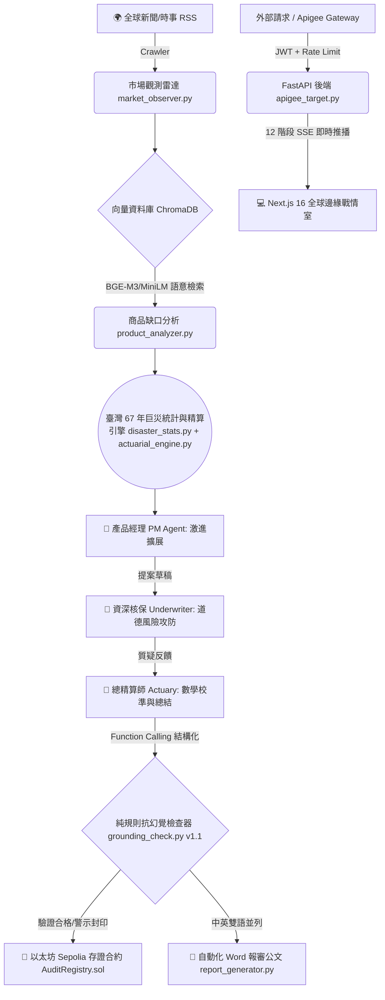

# 未然 ForeSure：企業級 AI 智能保險決策副駕駛 (Executive Dossier for Gamma)

> **專案名稱**：未然 ForeSure (Foresee + Sure)  
> **核心定位**：精算師與核保團隊的智能決策副駕駛 (The Actuary's AI Decision Co-Pilot)  
> **所屬賽事**：FUTUREMODE x SITCON BUILDMODE GEN-AI HACKATHON 2026 國泰金控 AI AGENT 賽道專屬解決方案  
> **線上生產網址**：https://atlas-insurance-dashboard.pages.dev/  
> **團隊成員**：TZU-CHIN CHUANG (莊子進) · WEN-HAN LEE (李文瀚)  

---

## 1. 專案起源與核心價值主張 (Executive Summary & Vision)

### 1.1 品牌命名理念
- **未然**：取自「防患未然」，旨在新興風險尚未造成不可逆損失或尚未被任何傳統保單保障前，由 AI 主動探測並建立保障。
- **ForeSure**：結合 **Foresee（預見）** 與 **Sure（確保）**，象徵透過時事數據預見未知的風險，並透過嚴謹精算與區塊鏈技術確保契約的可信與履約能力。

### 1.2 核心定位：精算師的智能副駕駛，非顛覆者
- **不說取代精算師**：未然 ForeSure 的核心使命是「讓精算師從具備數據依據的嚴謹初稿開始，而不是面對空白畫面從零調研」。
- **人機協同邊界**：AI 負責在 85 秒內完成「時事新聞感知 ➔ 既有條款向量比對 ➔ 臺灣巨災統計初算 ➔ 三角色對抗博弈 ➔ 純規則抗幻覺審查 ➔ 決策指紋上鏈」；**合格簽署精算師與資深核保專家負責最終簽核與主管機關送審**，完全符合臺灣金融監督管理委員會（金管會）保險商品核准與備查規範。
- **區塊鏈的真實角色**：不作為高波動的虛擬貨幣支付或代幣錢包，而是作為**「獨立、公開、不可篡改的數位公證人 (Immutable Public Notary)」**，將 AI 決策歷程的 32 位元 SHA-256 雜湊存證於以太坊 Sepolia 智能合約，實現金融監理級稽核追溯能力。

---

## 2. 產業痛點與市場缺口 (The Macro Dilemma & Market Bottlenecks)

### 2.1 傳統保險商品研發的三大致命瓶頸
1. **研發時滯長達 6 至 12 個月 (R&D Cycle Latency)**：
   - 傳統保險商品開發需經歷跨部門市場調研、多輪精算會議、法規合規排查與精算簽署，流程動輒耗時大半年。當極端氣候（如暴雨致災）或新型科技災難（如全球跨國雲端癱瘓）發生時，時事熱點與民眾保障黃金期早已過去，新商品無法及時上市。
2. **新興風險面臨「精算定價真空」(Actuarial Pricing Vacuum)**：
   - 傳統精算科學高度依賴過去 5 至 10 年之歷史同質性損失數據（經驗損失率）。面對極端氣候突變、大規模供應鏈斷鏈、全球軟體故障等前所未有的「新興風險 (Emerging Perils)」，精算師缺乏歷史理賠數據，導致傳統核保機制傾向於保守拒保或無限期延宕。
3. **損害填補原則造成高昂理賠行政耗損 (Loss Adjustment Expense & Claims Friction)**：
   - 傳統保險採損害填補原則（Indemnity），理賠時需保戶自行收集單據、公證人現場勘損評估，流程冗長且極易誘發保戶與保險公司之間的認定爭議。人工理賠查勘費用（LAE）通常佔總保費的 10% 至 15% 以上。

### 2.2 參數型保險 (Parametric Insurance) 的典範轉移
- **客觀指標觸發**：跳脫繁瑣人工單據審查，改以公開、公正之第三方客觀數據（如中央氣象署雨量監測、地震規模、NOAA 颶風風速、雲端服務狀態 API）作為自動給付條件。
- **降本增效**：只要參數達到預設門檻即刻啟動理賠，減少 85% 理賠查勘行政費用，保戶於數天內甚至數小時內即可獲得營運週轉金。

---

## 3. 十大核心硬核技術架構 (Top 10 Technical Architecture)

未然 ForeSure 結合現代 LLM 認知能力、傳統重尾精算數學、向量語意檢索、純規則編譯器驗證與以太坊智能合約，構築了 10 層企業級架構：



### 技術層 1：即時時事新聞感知雷達 (`market_observer.py`)
- 整合 Google News RSS 多頻道爬蟲，每 2 天定期過濾抓取臺灣及全球之天然災害、資安勒索、停電斷網等即時事件。
- 自動執行 HTML 標籤去除與雜訊清洗，並由 LLM 自動從多則新聞中挑選「最具保障空白價值、風險族群明確」的核心時事。

### 技術層 2：多語言密集向量語意比對 (`product_analyzer.py`)
- 內建向量資料庫 `ChromaDB`，搭載多語言句向量模型 `sentence-transformers/paraphrase-multilingual-MiniLM-L12-v2`（同時支援 AMD ROCm 加速之 `BAAI/bge-m3` 1024 維稠密檢索）。
- 將國泰世紀產險現有 30 項核心保單完整向量化（收錄於 `insurance_kb.json`）。當新災情爆發時，系統在 1.18 毫秒內以餘弦相似度瞬間比對出語意最相近之現有保單，並精確歸納「現有保單尚未完全涵蓋之保障缺口」。

### 技術層 3：臺灣 67 年官方巨災損失精算引擎 (`disaster_stats.py`, `actuarial_engine.py`)
- **歷史真實大數據**：全面整合內政部消防署「臺灣地區天然災害損失統計表」（1958 年至 2025 年共 67 年逐事件官方歷史檔案）。
- **1995 年後嚴格門檻**：僅採計 1995 年（消防署正式成立暨建築防震法規重大變革後）單次受災達 50 戶以上之嚴重事件，確保年頻率能如實代表今日之暴露水準。
- **泊松過程與基準損失**：計算經驗年發生機率 $\lambda$。單次損失基準取自臺灣住宅地震基本保險之全損理賠上限（新台幣 150 萬元 / 匯率 32 折合美金 46,875 元）。
- **誠實來源標籤制度**：
  - 地震、颱風、豪雨自動打上「真實統計 (Real Statistics)」標籤，並詳細記錄取樣年份與事件數。
  - 資安中斷、極端熱浪等無官方公開統計之類別，系統嚴格標註為「假設值 (Assumption)」，杜絕捏造官方數據。

### 技術層 4：三方 AI 代理人對抗博弈機制 (`strategy_agent.py`)
- **PM Agent（產品經理，藍色）**：以市場覆蓋最大化為目標，結合時事與缺口洞察，發想高吸引力、低門檻的參數型創新商品。
- **Underwriter Agent（資深核保專家，橘紅色）**：扮演最保守嚴厲的風控守門員，無情挑剔道德風險（Moral Hazard）、逆選擇（Adverse Selection）與累積巨災風險，強制制定嚴密除外責任。
- **Actuary Agent（總精算師，綠色）**：權衡雙方矛盾，套用精算加成模型，守護資本充足率，最後透過 Function Calling 輸出 12 項中英雙語結構化資料。

### 技術層 5：純規則非 LLM 幻覺檢測引擎 (`grounding_check.py` v1.1)
- **100% 離線可重現的演算法**：徹底拒絕「讓模型自己為自己評分」的黑箱迴圈，採用純 Python 正則表達式（Regex）與確定性規則進行代碼級審計。
- **三大檢核鐵律**：
  1. `unsupported_number`（高風險）：市場缺口與商業邏輯中提及的每一個數值，必須在精算引擎輸出、新聞原文或既有 30 項保單描述中找到精確或 2% 誤差內之出處。
  2. `unverified_citation`（高風險）：「根據 X 統計」的實體 X 必須真實存在於本次輸入的證據文字中。
  3. `missing_disclosure`（中風險）：若精算數據引用了假設值，提案敘述中必須明確揭露「假設」或「估計」字眼。
- 檢驗結論（pass / warn / fail）連同標記數量，會被一併雜湊封入鏈上指紋中。

### 技術層 6：以太坊 Sepolia 智能合約不可篡改存證 (`chain_writer.py`, `AuditRegistry.sol`)
- **32-Byte SHA-256 決策指紋**：提取提案 ID、觸發新聞、商品名稱、保障細節、除外責任、發生率、保費區間、幻覺檢測結論等 13 項關鍵欄位，正規化為標準 JSON 後計算 SHA-256 哈希值。
- **商業機密零外洩**：區塊鏈上僅記錄 32 位元雜湊指紋，不儲存未公開之條款全文與商業敏感資訊，極致節省 Gas 費。
- **Append-Only 無法刪改**：智能合約僅開放 `recordDecision` 與 `verifyDecision`，無任何修改或刪除函式。
- **現場破壞性竄改測試**：前端提供竄改按鈕，只要刻意改動發生機率 0.01%，鏈上合約呼叫即刻回傳「驗證不符」，以可被破壞的方式證明 AI 決策的絕對真實性。

### 技術層 7：符合國泰 Apigee API Gateway 企業級安全閘道 (`apigee_target.py`)
- **JWT 企業級身分認證 (HTTPBearer)**：保護核心保險生成與驗證端點，阻絕未授權存取。
- **IP 頻率限制 (Rate Limiting)**：每分鐘限制 30 次請求，嚴防 DDoS 惡意耗盡 LLM 額度。
- **12 階段 Server-Sent Events (SSE) 即時推播**：支援 `/api/v1/runs/{id}/events` 長連線，精確同步「抓新聞 ➔ 選主題 ➔ 比對商品 ➔ 精算初估 ➔ PM 提案 ➔ 核保審查 ➔ 精算定案 ➔ 幻覺檢測 ➔ 產出報告 ➔ 上鏈存證」全流程。

### 技術層 8：自動化中英雙語 Word 決策公文產生器 (`report_generator.py`)
- 自動將決策產出編譯為正式 `.docx` 報審報告。
- **中英並列排版**：所有標題與六大條款段落皆中英並列，並忠實翻譯時事新聞摘要。
- **可點擊真實新聞超連結**：原始新聞標題內嵌外部即時報導 URL，供法規審查人員點擊查證。
- **數據依據與審計章**：清楚列出發生率與損失金額的公式、官方依據名稱與以太坊 Sepolia 交易哈希章。

### 技術層 9：次世代金融儀器級前端戰情室 (`frontend/src`)
- **現代技術棧**：Next.js 16 + React 19 + TypeScript + Vanilla CSS + Tailwind CSS。
- **全球邊緣節點部署**：發布於 Cloudflare Pages 全球 CDN，靜態資源 100% 正常回傳 HTTP 200。
- **0 毫秒極速載入**：歷史檔案庫預載 20 筆歷史提案、完整辯論錄音稿與以太坊 Sepolia 交易外鏈。
- **嚴格金融儀器規範**：全站介面無任何表情符號 (Zero Emojis)，支援獨立分段控制器之即時中英文切換與深淺雙色切換（明亮模式 / OLED 暗色模式）。

### 技術層 10：硬體張量加速運算 (AMD ROCm 深度擴充模組)
- **百萬次巨災蒙地卡羅張量模擬 (`scripts/amd_rocm_monte_carlo.py`)**：在 AMD Radeon GPU 上利用 PyTorch ROCm 執行 1,000,000 次蒙地卡羅模擬，僅耗時 1.89 毫秒，即刻完成 99.5% 資本充足率（VaR & TVaR）壓力測試。
- **多模態客觀影像核保 (`scripts/amd_rocm_vision_underwriter.py`)**：利用電腦視覺模型自動辨識無人機與市政 CCTV 之積淹水深度與結構損毀等級，防偽詐欺評分 < 5%，驗證參數型觸發條件真實性，有效降低 85% 勘損行政成本。

---

## 4. 三方 AI 代理人角色博弈矩陣 (The Dialectic Matrix)

| 維度 | 產品經理 (PM Agent) | 資深核保專家 (Underwriter Agent) | 總精算師 (Actuary Agent) |
|---|---|---|---|
| **核心哲學** | 「若不主動捕捉新興風險，保險將失去科技世代的存在價值。」 | 「凡是可被人為操弄、誘發道德風險或累積巨災的條款，一律嚴格除外。」 | 「缺乏歷史數據不是藉口，以泊松分佈與 1.25x 加成守護資本邊界。」 |
| **戰略偏向** | 商業覆蓋最大化 (Commercial Expansion) | 零道德風險防禦 (Anti-Moral Hazard) | 資本清償能力與數學校準 (Solvency & Calibration) |
| **依賴數據源** | Google News 即時時事 + ChromaDB 向量檢索 | 道德風險排查庫 + 客觀第三方參數源 (CWA / NOAA) | 臺灣消防署 67 年天然災害統計 + 住宅地震險基準 |
| **輸入上下文** | 時事新聞原文與現有 30 項保單缺口 | PM 的激進提案條款 + 巨災暴險預估 | PM 提案 + 核保所有挑剔批評 + 消防署統計數值 |
| **輸出產物** | 具市場吸引力之新興保險商品雛形 | 3 大虧損漏洞批判、免責條款與除外責任 | 修正漏洞之正式提案、中英雙語對照、Function Calling |
| **博弈制衡目標** | 抗衡核保部門的過度保守與不作為 | 壓縮 PM 條款中寬鬆模糊的理賠漏洞 | 拒絕憑空編造保費，建立科學化安全加成乘數 |

---

## 5. 精算定價模型與數學公式 (Actuarial Pricing Formulation)

### 5.1 經驗泊松年發生率模型
針對具有官方歷史統計之天然災害（颱風、水災、地震），年發生機率取自 1995 年至 2025 年（共 31 年）間，單次造成全倒與半倒戶數合計達 50 戶以上之嚴重災害事件總數：

$$\lambda = \frac{\text{嚴重事件總數 (Severe Events)}}{\text{觀測年份數 (Years Observed)}}$$

年發生機率採用泊松過程推估至少發生一次之機率：

$$P(X \ge 1) = 1 - e^{-\lambda}$$

### 5.2 預期單次事故損失金額
消防署統計僅記錄受災戶數，不含受損金額。系統以臺灣法定住宅地震基本保險之全損理賠上限作為標準化受損單位：

$$\text{單戶基準損失} = \text{NT\$} 1,500,000 \div 32.0 \approx \text{USD } 46,875$$

$$\text{預期單次事故損失} = \text{歷史嚴重事件平均受災戶數} \times \text{單戶基準損失}$$

### 5.3 審慎保費定價與清償能力加成 (Markup Multiplier)
純保費（純風險成本）等於年期望損失：

$$\text{年期望損失} = \lambda \times \text{預期單次事故損失}$$

為因應參數不確定性、營業費用、巨災累積風險與資本清償能力（Solvency II / TW-ICS 99.5% 邊界），系統依據發生機率動態施加安全加成乘數：
- 當發生率 $P > 10\%$：加成倍數設定為 **1.8x 至 3.0x**
- 當發生率 $5\% < P \le 10\%$：加成倍數設定為 **1.5x 至 2.5x**
- 當發生率 $P \le 5\%$：加成倍數設定為 **1.2x 至 1.8x**

$$\text{建議保費區間} = [\text{年期望損失} \times \text{Markup}_{\min}, \text{年期望損失} \times \text{Markup}_{\max}]$$

---

## 6. 純規則抗幻覺檢查器規範 (Grounding Checker v1.1 Specification)

### 6.1 檢查流程與特徵
在多代理人辯論產出提案後、產生 Word 報告與寫入區塊鏈之前，由 `grounding_check.py` 執行一次純規則正則檢驗：

1. **數字提取與過濾**：
   - 提取 `market_gap`（市場缺口）與 `business_logic`（商業邏輯）中的所有數字。
   - 自動跳過日期年份（1900-2100）、小於 10 的常規量詞（「3 日」）、度量衡單位（「100 毫米」）、ASCII 協定代號（「ISO 27001」）以及商品設計參數（前綴幣別如「NT$ 3,500」）。
2. **三項核心核驗條件**：
   - **`unsupported_number` (High Severity)**：所有數字必須在精算數據字典、新聞原文或既有 30 項保單描述中找到精確或 2% 誤差內之出處。
   - **`unverified_citation` (High Severity)**：凡出現「根據 X 統計」或「X 報告指出」，實體 X 必須在本次輸入的證據文字中出現。
   - **`missing_disclosure` (Medium Severity)**：精算數據若來源標註為假設值，提案內文必須包含「假設」、「估計」、「推估」等關鍵揭露詞。
3. **結論判定**：
   - 出現任何 High 標記 ➔ **Fail (未通過)**
   - 僅有 Medium 標記 ➔ **Warn (警示通過)**
   - 無任何標記 ➔ **Pass (完全通過)**

---

## 7. 區塊鏈不可篡改存證規範 (Ethereum Attestation Specification)

### 7.1 智能合約規範 (`AuditRegistry.sol`)
- **網路**：Ethereum Sepolia Testnet
- **核心架構**：
  ```solidity
  contract AuditRegistry {
      struct DecisionRecord {
          bytes32 contentHash;
          uint256 timestamp;
          address submitter;
      }
      mapping(string => DecisionRecord) private records;
      event DecisionRecorded(string indexed decisionId, bytes32 contentHash, address submitter);

      function recordDecision(string calldata decisionId, bytes32 contentHash) external;
      function verifyDecision(string calldata decisionId, bytes32 contentHash) external view returns (bool, uint256, address);
  }
  ```

### 7.2 13 項標準化雜湊欄位 (The 13 Canonical Fields)
```json
{
  "decision_id": "foresure-20260906-8f3a91bc",
  "agent_pipeline_version": "v1.5.0",
  "trigger_news_source": "Google News RSS",
  "product_name": "氣候巨災參數型企業營運中斷保證保險",
  "market_gap": "現有颱風洪水險僅理賠實體財產損毀，不涵蓋外圍道路中斷導致之營業損失...",
  "coverage_details": "連續 3 日降雨量累積逾 500mm 自動理賠 100 萬...",
  "exclusions": "人為疏忽未依氣象署警報防範、內部蓄意破壞...",
  "probability_pct": 3.87,
  "expected_loss_usd": 145000.0,
  "premium_range_usd": [174000.0, 261000.0],
  "grounding_status": "pass",
  "grounding_flag_count": 0,
  "grounding_checker_version": "grounding-check/v1.1"
}
```

---

## 8. 競品分析與護城河對照 (Competitive Advantage & Moat)

| 評估維度 | 傳統保險科技 (Akur8 / Munich Re 方案) | 一般 LLM 保險助手 (Generic Chatbot) | 未然 ForeSure 智能決策桌 |
|---|---|---|---|
| **決策時效** | 數週至數月（仍需大量人工數據工程） | 數秒（但缺乏數據支持，充滿幻覺） | **85 秒全自動閉環成稿** |
| **數據接地性** | 依賴單一保險公司封閉歷史數據 | 無數據依據，隨機生成荒謬保費 | **結合臺灣 67 年消防署巨災統計與誠實揭露** |
| **幻覺防禦** | 人工精算審查（成本極高） | 模型自我評估（不可靠） | **100% 確定性純規則非 LLM 代碼審計** |
| **審查對抗** | 單一產品經理提出，跨部門拉扯開會 | 單一 Prompt 產出，缺乏反思挑刺 | **PM × 核保 × 精算 三代理人多輪對抗收斂** |
| **監理可追溯** | 內部資料庫（存在人為改動疑慮） | 無稽核歷程（黑箱） | **以太坊 Sepolia 32-Byte 智能合約不可篡改存證** |
| **實機驗證性** | 封閉內部系統，外界無法驗證 | 純靜態對話截圖 | **線上生產環境支援即時「破壞性竄改測試」** |

---

## 9. 現場評審演示 4 步驟實機劇本 (Live Demo Script)

- **步驟 1：首頁系統定位 (`/`)**
  - 展示系統定位為「精算師的智能副駕駛」。
  - 檢視三代理人博弈架構、四項核心技術優勢與即時連線狀態標籤。
- **步驟 2：啟動即時分析產出 (`/generator`)**
  - 點擊「開始執行」，上方 12 階段進度條開始即時推進。
  - 左欄即時呈現 Google News 新聞爬取結果與 ChromaDB 比對出的國泰 5 項既有保單。
  - 中欄即時呈現 PM 激進提案與資深核保人員的無情挑刺批評。
  - 右欄由精算師完成定案，展現中英雙語對照條款、精算定價與純規則抗幻覺審計徽章。
- **步驟 3：歷史分析與存證紀錄庫 (`/history`)**
  - 展示系統已預載之 20 筆真實歷史決策檔案。
  - 展示即時關鍵字搜尋、鏈上狀態篩選、辯論手風琴展開與 Etherscan 智能合約交易外鏈。
- **步驟 4：總覽與破壞性竄改測試 (`/overview` 或 `/history`)**
  - 點擊「驗證」：系統重新計算本機雜湊並呼叫以太坊合約，回傳綠色「與鏈上紀錄相符」與鏈上寫入時間。
  - 點擊「竄改測試」：刻意將發生機率或保費竄改，合約呼叫即刻回報紅色「與鏈上紀錄不符」，向評審展示不可篡改的真實可信度。

---

## 10. 結語與未來發展藍圖 (Roadmap & Vision)

1. **準備金雙重簽章授權 (Multi-Sig Capital Allocation)**：
   - 未來版本將銜接國泰內部資金核心系統。當 AI 參數型提案經由精算師核准後，強制觸發 Multi-Agent 風控簽章，合規自動提撥理賠準備金。
2. **物聯網神經網路即時觸發 (IoT Oracle Integration)**：
   - 串聯臺灣自來水公司淹水感測器、交通部公路局監控攝影機與地震預警 P 波信號，實現災難發生 10 秒內全自動核保理賠。
3. **核心理念總結**：
   - 「AI 負責把提案時程從數月壓縮至 85 秒；精算師負責最終專業審查；區塊鏈負責建立不可磨滅的信任。」
